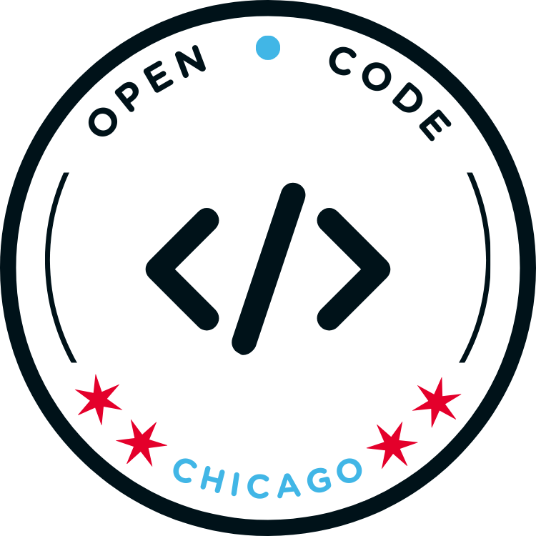

**<h1 align="center">Welcome to Open Code Chicago</h1>**

<b>Open Code Chicago</b> is a vibrant open-source community committed to fostering collaboration, innovation, and learning in the tech world.

---

**Get Involved**
- Join our [Discord server](https://discord.gg/t6MGsCqdFX).
- Contribute to our [GitHub repositories](https://github.com/OpenCodeChicago).
- Attend our [Meetup events](https://www.meetup.com/open-code-chicago).

**Our Mission**
To bring together IT enthusiasts of all skill levels—whether you're an experienced developer, a networking enthusiast, or just starting out—to connect, share knowledge, and contribute to meaningful projects.

🚀 **Let's build something amazing together!**

---

**Upcoming Event**:

  

---

 <em><b>We love connecting with different people</b> so if you want to say <b>hi, We'll be happy to meet you more!</b> :)</em>
